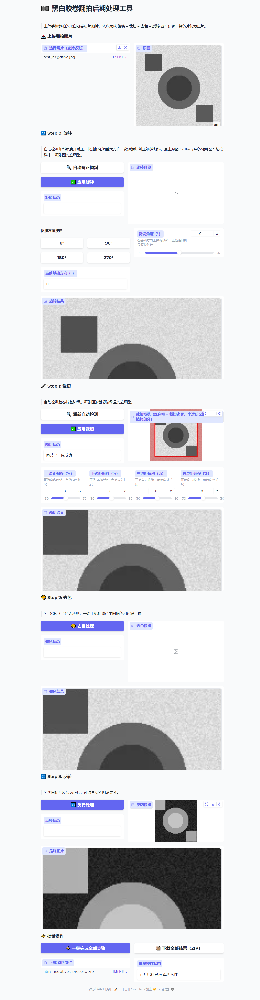

# 🎞️ 黑白胶卷翻拍后期处理工具 / B&W Film Negative Processing Tool

> 上传手机翻拍的黑白胶卷负片照片，依次完成 **旋转 → 裁切 → 去色 → 反转**，将负片转为正片。
> 
> Upload phone-scanned B&W film negatives, and process them through **Rotate → Crop → Desaturate → Invert** to produce positive images.

一个基于 [Gradio](https://gradio.app/) 的黑白胶卷负片翻拍后期处理工具。支持批量处理多张图片，自动检测倾斜和裁切边界，也可手动微调，一键完成全部步骤并打包下载。支持中文、英文、日文三种语言，在页面底部设置面板中切换。

A Gradio-based tool for post-processing scanned B&W film negatives. Supports batch processing, automatic tilt/crop detection with manual fine-tuning, one-click full pipeline, and ZIP download. Supports Chinese, English, and Japanese — switch languages in the Settings panel at the bottom of the page.



## 功能 / Features

- **旋转矫正** — 自动检测倾斜角度，支持快捷方向按钮和微调滑块
- **裁切** — 自动检测胶卷片基边缘，每张图独立手动微调偏移量
- **去色** — 去除 RGB 偏色和色温干扰，转为灰度
- **反转** — 将负片反转为正片，还原真实明暗关系
- **批量处理** — 一键完成全部步骤，ZIP 打包下载结果
- **多语言** — 支持中文、英文、日文，页面底部设置面板切换

## 项目结构 / Project Structure

```
film-reveal/
├── src/film_reveal/                # 源代码包
│   ├── app.py                      # 主入口 — UI 组装 + 跨步骤回调
│   ├── i18n/                      # 多语言翻译 (zh/en/ja)
│   │   ├── __init__.py             # I18n 实例工厂
│   │   └── translations.py        # 三语翻译字典
│   ├── state.py                    # 应用状态管理 (AppState + TypedDict)
│   ├── __main__.py                 # python -m film_reveal 入口
│   ├── steps/                      # 处理步骤模块
│   │   ├── common.py               # 批处理辅助函数
│   │   ├── rotate.py               # 旋转步骤
│   │   ├── crop.py                 # 裁切步骤
│   │   ├── desaturate.py           # 去色步骤
│   │   └── invert.py               # 反转步骤
│   └── processing/                 # 图像处理核心逻辑
│       ├── core.py                 # 基础操作 (旋转、裁切、去色、反转)
│       ├── detection.py            # 自动检测算法 (倾斜、裁切边界)
│       └── pipeline.py             # 处理管道组合逻辑
├── image/                          # 测试图片目录
├── run.py                          # 启动脚本
├── requirements.txt                # Python 依赖
├── LICENSE                         # MIT 许可证
└── docs/                           # 文档
```

## 安装 / Installation

```bash
pip install -r requirements.txt
```

## 运行 / Usage

```bash
python run.py
```

访问 http://127.0.0.1:7860/

## 处理流程 / Pipeline

1. **上传** — 选择多张翻拍负片照片
2. **旋转** — 自动或手动矫正倾斜（每张图独立调整）
3. **裁切** — 自动检测片基边缘 + 手动微调偏移量
4. **去色** — RGB → 灰度，去除偏色干扰
5. **反转** — 255 - pixel，负片 → 正片
6. **下载** — ZIP 打包所有最终正片

## 技术说明 / Technical Details

- 倾斜检测：基于行列灰度梯度分析，定位胶卷边缘走向
- 裁切检测：扫描行/列灰度分布，区分片基区域与图像内容区域
- 去色：RGB 各通道加权求和 (`0.299R + 0.587G + 0.114B`)
- 反转：像素值取反 (`255 - pixel`)

## 许可证 / License

MIT License — 详见 [LICENSE](LICENSE) 文件。